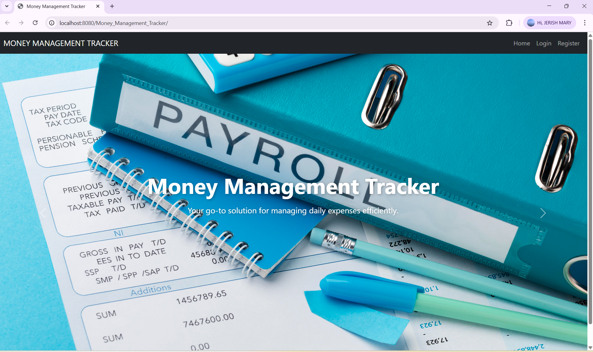
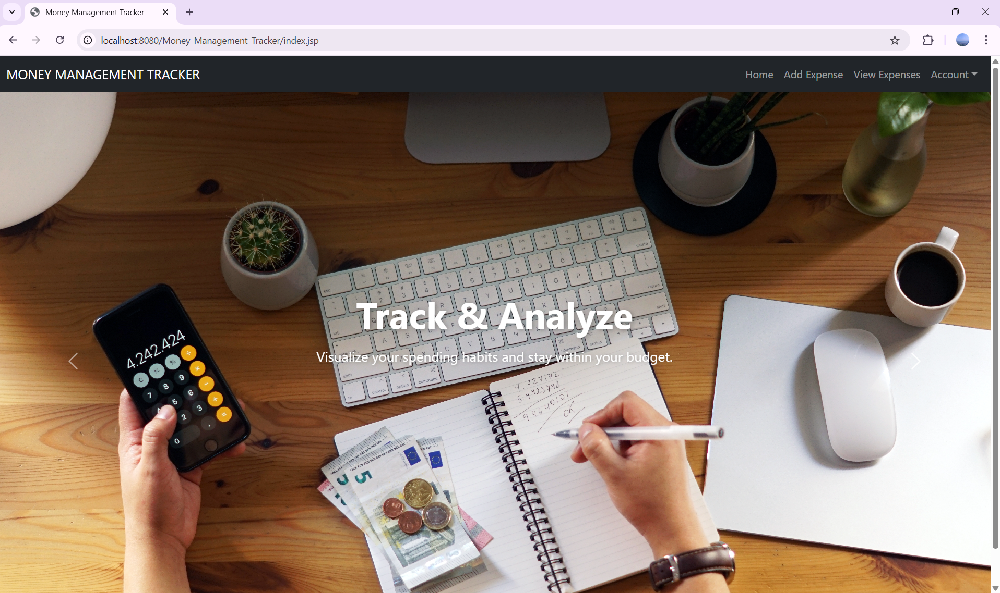
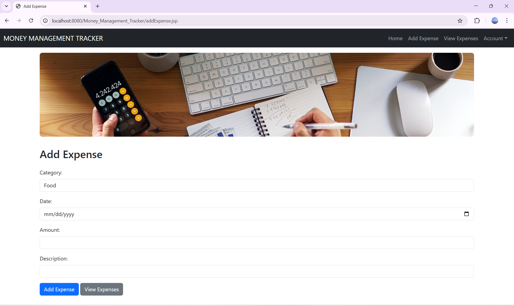
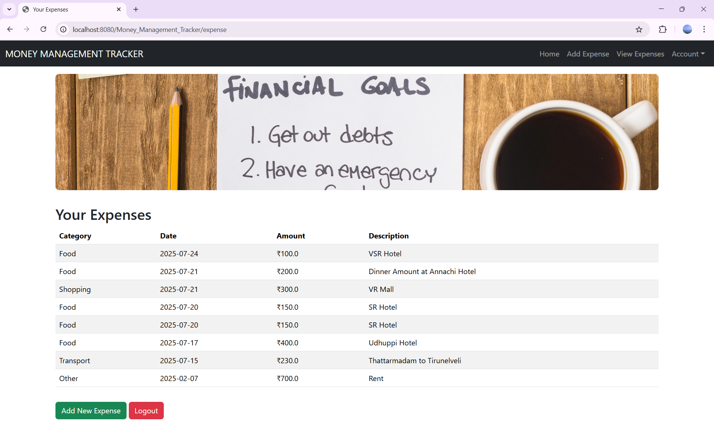

# 💰 Money Management Tracker

A web-based personal finance tracking system that helps users monitor their income, expenses, and savings in one place. Built using Java, JSP, Servlets, and MySQL, this project is designed to enhance money awareness and promote budgeting discipline.

---

## 🚀 Features

- ✅ User Registration & Login
- 📈 Add and view expenses and incomes
- 📊 Categorize transactions
- 📅 Monthly and yearly summaries
- 🔐 Session management for security

---

## 🖼️ Screenshots

### 🏠 Dashboard


### 🏠 User Dashboard


### ➕ Add Expense


### 📅 view Expense


> 📌 Add your actual screenshots into the `Screenshots/` folder and make sure the filenames match.

---

## 🛠️ Tech Stack

- 👨‍💻 Java (JDK 17)
- 🌐 JSP & Servlets
- 🛢️ MySQL
- 🔗 JDBC
- 🎨 HTML, CSS, JavaScript
- 🐱 Git & GitHub
- 🚀 Apache Tomcat 10

---

## 🧪 How to Run

1. Clone the repository:
   ```bash
   git clone https://github.com/JerishRaj/Money_Management_Tracker.git
2.Import into Eclipse as a Dynamic Web Project

3.Set up your MySQL database using the provided SQL scripts

4.Configure DB connection in DBConnection.java

5.Run the project using Apache Tomcat
📩 Contact
📧 Email: jerishraj@example.com
📱 LinkedIn: linkedin.com/in/jerishraj


---

Let me know if you want:
- a matching **LinkedIn post caption**
- a **license** section
- or help adding the actual screenshots in your repo and README.
